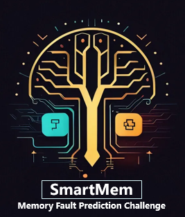

# Motivation

Memory uncorrectable Errors (UEs) have been identified as a major failure cause in
data centers, which highly threaten the availability and reliability of the server and
even the entire computing clusters. Forecasting UEs before enacting preemptive
maintenance measures has emerged as a viable strategy for diminishing server outages
and some machine learning based solution have also been proposed. However,
the UEs prediction presents several challenges: data noise and extremely imbalance
as the UEs are exceedingly rare in memory events; heterogeneous data sources
as the DRAMs in the field come from different manufacturing or architecture
platforms; distribution shifts due to the hardware aging; and latent factors due to
the dynamic access mechanism. We cure a real-world DRAM error dataset that
contains both micro and bit information and present a two-stage challenge for more
efficient and generalized event prediction solution. We believe the competition will
provide a breeding ground to foster discussions and further progress on several
important research topics towards real-world ML applications. 

While adapting machine learning models to UE prediction tasks have gained increasing
interest in both the machine learning and computer architecture community, improving the UEs
prediction is widely recognized as a challenging problem.

1. <b>First</b>: CEs are demonstrated as informative to UEs prediction, but the memory failure is coupled by the unclear uncorrectable patterns as well as the data access mechanism. A fault only manifests in failure if the faulty location is accessed.
2. <b>Second</b>: UEs are exceedingly rare in memory events. This rarity renders machine learning
methods highly vulnerable to imbalanced data, leading to high false positives and low recall rates.
3. <b>Third</b>:memory data is inherently noisy and heterogeneous as the hardware comes from different
manufacturers (e.g.Samsung, Hynix, Micron) and is deployed in diverse operational environments. Missing data is also inevitable in data collection or transmission.
4. <b>Forth</b>: predicting UEs necessitates
addressing the complex spatial and temporal variations within memory architecture, particularly
given hardware degradation throughout its operational lifecycle.
5. <b>Fifth</b>: the chips in the field always
come across different architectures or generations, showing distinct characteristics in both error rate
and uncorrectable pattern.
5. <b>Last but not the least</b>: there is no large-scale dataset specifically focusing
on CE information in DQ and beat level for UE predictions publically available due to privacy issues.

# Targets

Our competition will furnish participants with a dataset comprising memory system
configurations, memory error logs, and failure tags to devise solutions for predicting potential failures
of individual DRAM modules within a subsequent observation period. The competition comprises
two stages: the initial stage features an AB List setup, which includes training data tailored for two
diverse memory models. Subsequently, in the second stage, a fresh dataset encompassing mixed
models (more than two) will be introduced to encourage solutions with few-shot learning capabilities
and knowledge transfer ability. Overall, the competition’s appeal lies in its practical relevance, the
accessible entry point of the initial stage, and the fresh challenges presented in both stages. 

# Impact

Datacenter RAS is important to both industry and society in the era of artificial intelligence. However,
the intelligent memory failure prediction is still barely satisfactory due to the complexity of the
problem, lack of publically available large-scale datasets, well-defined tasks and evaluation procedures.
As a failure prediction from real-world scenarios with large, complex, and inflexible present explicit
information, this competition will increase the access and usability of solving important problems in
the cloud computing industries. In addition, the new competition will kick-start the development of
novel feature extraction, spatial-temporal pattern mining, and representation learning techniques for
event prediction. Novel methods and ideas proposed for this competition will also be transferable to
similar tasks in which a set of declarative specifications need to be precisely extracted from given
technical descriptions. We believe the competition will provide a breeding ground to foster discussions
and further research on several important research topics towards real-world ML applications, such
as distribution shifts, data imbalance, table representation learning, causal representation learning
and etc. 

